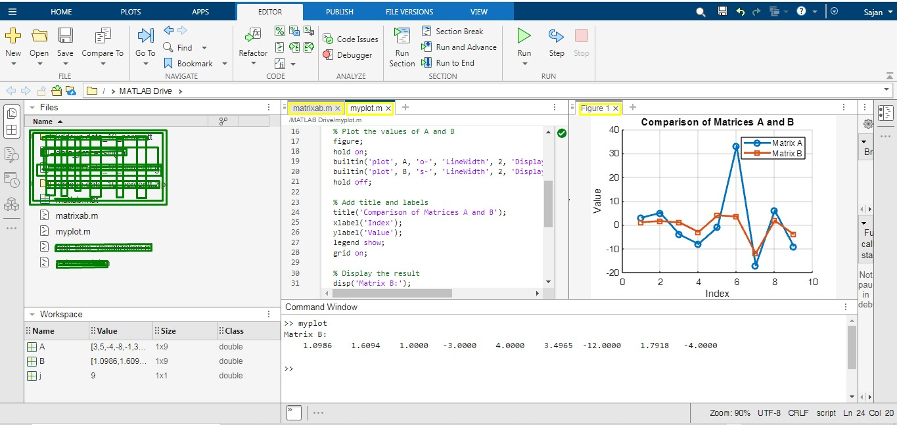

# MATLAB Project Collection

Welcome to the MATLAB Project Collection hosted by 54J4N! This repository is designed to showcase a variety of MATLAB projects covering different aspects of mathematical modeling, algorithm development, and data visualization.

## Featured Image


## Projects Overview
In this repository, you will find MATLAB scripts and applications that demonstrate the powerful capabilities of MATLAB for solving complex mathematical problems and performing sophisticated data analysis and visualization.

### Current Projects Include:
- **System Performance Monitoring**: Real-time monitoring of CPU and RAM usage.
  
- **Linear Equation Solver**: Solving large systems of linear equations efficiently.
  
- **Network Intrusion Detection System (NIDS)**: Develops a Network Intrusion Detection System (NIDS) using MATLAB. It utilizes advanced data processing, machine learning algorithms, and                                                  real-time visualization to analyze network traffic data. The goal is to identify suspicious patterns that may indicate cyber attacks and                                                   ensure network security. This system processes large datasets to classify network traffic as normal or potentially harmful, using                                                          MATLAB's robust computational and visualization capabilities.
- **Matrix-Transformation-Logarithm**: This project demonstrates a matrix transformation in MATLAB based on specific conditions. It involves: Computing the natural logarithm of elements                                          in the matrix that are greater than 1. Adding 5 to each element that is less than or equal to 1. Problem: Transform matrix A:               
                                       A[3,5,−4,−8,−1,33,−17,6,−9]  By appllying:  Natural logarithm to elements>1.  Add 5 to elements ≤ 1
  
              
  
- More projects will be added periodically.

## Getting Started
To get started with these projects, clone the repository to your local machine:

```bash
git clone https://github.com/54J4N/MATLAB_Project.git
Navigate to the project directory:

cd MATLAB_Project
Open the project files in MATLAB and run the scripts as described in the individual project folders.

